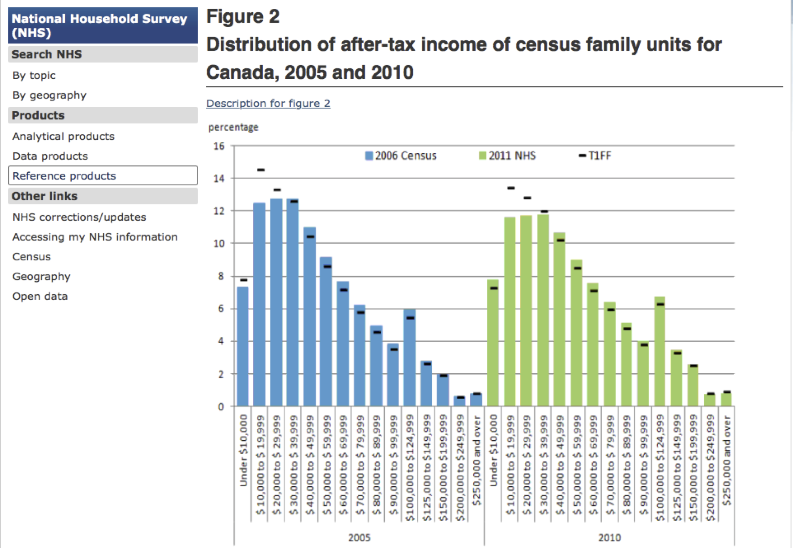

Chapter 2
=========

Visualizations
==============

While we have been able to make several interesting observations about data by
simply running our eyes down the numbers in a table, our task would have been
much harder had the tables been larger.  In data science, a picture can be
worth a thousand numbers.

We saw an example of this earlier in the text, when we examined John Snow's map
of cholera deaths in London in 1854.

Snow showed each death as a black mark at the location where the death
occurred. In doing so, he plotted three variables — the number of deaths, as
well as two coordinates for each location — in a single graph without any
ornaments or flourishes. The simplicity of his presentation focuses the
viewer's attention on his main point, which was that the deaths were centered
around the Broad Street pump.

Technology can be a help as well as a hindrance. Sometimes, the ability to
create a fancy picture leads to a lack of clarity in what is being displayed.
Inaccurate representation of numerical information, in particular, can lead to
misleading messages.

Here, from the Washington Post in the early 1980s, is a graph that attempts to
compare the earnings of doctors with the earnings of other professionals over a
few decades. Do we really need to see two heads (one with a stethoscope) on
each bar? Tufts coined the term "chartjunk" for such unnecessary
embellishments. He also deplores the "low data-to-ink ratio" which this graph
unfortunately possesses.

Most importantly, the horizontal axis of the graph is is not drawn to scale.
This has a significant effect on the shape of the bar graphs. When drawn to
scale and shorn of decoration, the graphs reveal trends that are quite
different from the apparently linear growth in the original. The elegant graph
below is due to Ross Ihaka, one of the originators of the statistical system R.

Here is a graphic from Statistics Canada, a website produced by the Government
of Canada.

The graphs represent the distribution of after-tax income, in Canadian dollars,
of families in Canada. The blue graph uses figures from the 2006 Census while
the green graph shows estimates for 2010 based on the National Household
Survey.

Based on what you have learned about visualization thus far, what is your
assessment of this graphic?

Sampling
========



Explorations: Privacy
=====================

Coming soon...
{# include "../notebooks-html/Privacy.html" #}

Appendix: Statements
====================


