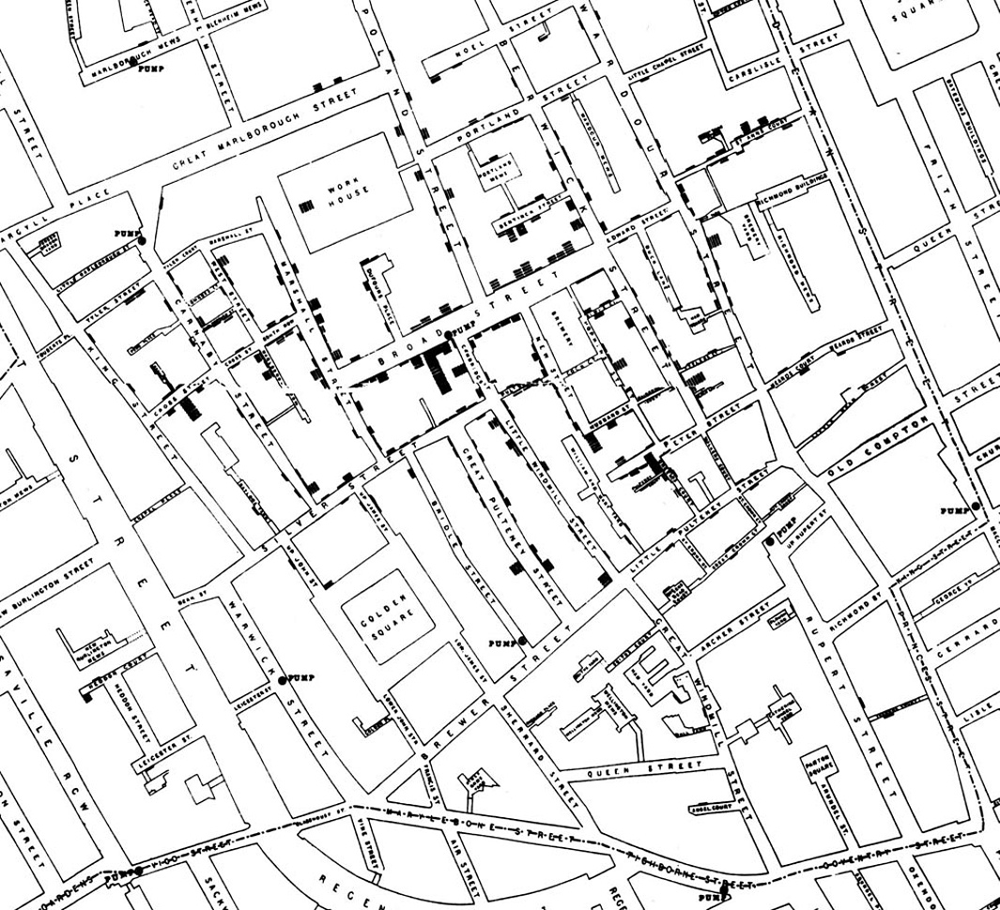
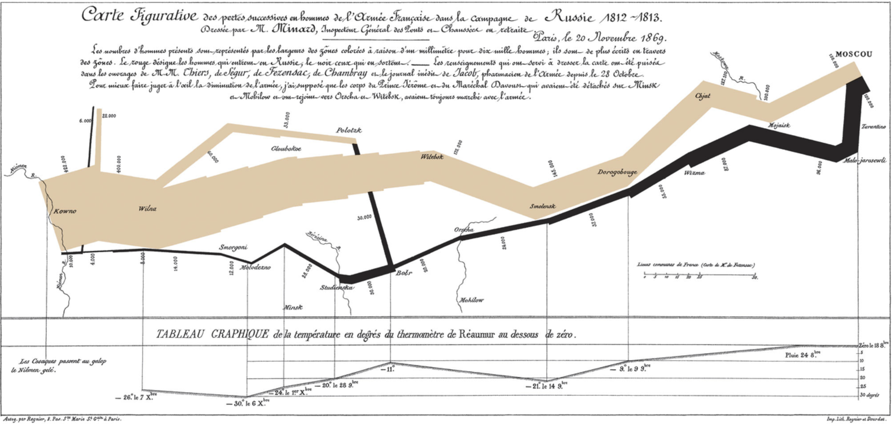
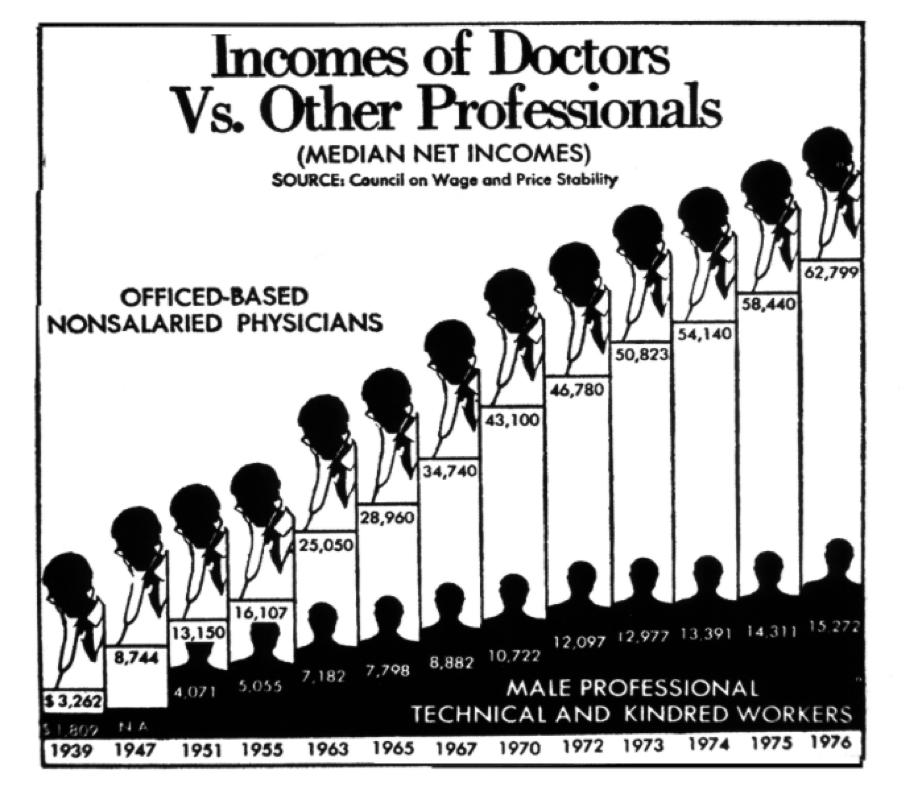
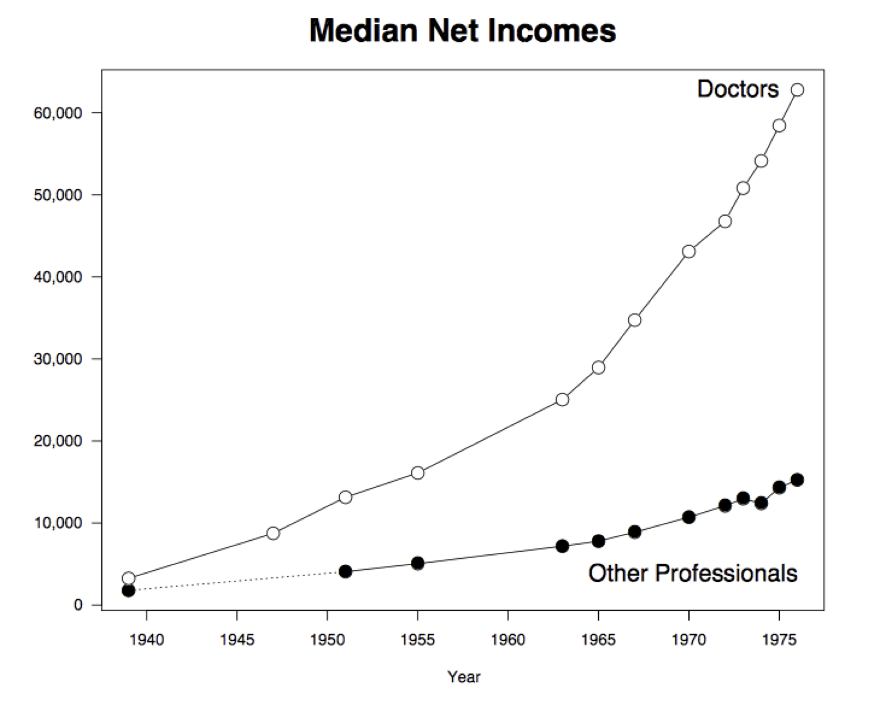

Chapter 2
=========

Visualizations
==============

While we have been able to make several interesting observations about data by
simply running our eyes down the numbers in a table, our task becomes much
harder as tables been larger.  In data science, a picture can be worth a
thousand numbers.

We saw an example of this earlier in the text, when we examined John Snow's map
of cholera deaths in London in 1854.

Snow showed each death as a black mark at the location where the death
occurred. In doing so, he plotted three variables — the number of deaths, as
well as two coordinates for each location — in a single graph without any
ornaments or flourishes. The simplicity of his presentation focuses the
viewer's attention on his main point, which was that the deaths were centered
around the Broad Street pump.

In 1869, a French civil engineer named Charles Joseph Minard created what is
still considered one of the greatest graph of all time. It shows the decimation
of Napoleon's army during its retreat from Moscow. In 1812, Napoleon had set
out to conquer Russia, with over 400,000 men in his army. They did reach
Moscow, but were plagued by losses along the way; the Russian army kept
retreating farther and farther into Russia, deliberately burning fields and
destroying villages as it retreated. This left the French army without food or
shelter as the brutal Russian winter began to set in. The French army turned
back without a decisive victory in Moscow. The weather got colder, and more men
died. Only 10,000 returned.

The graph is drawn over a map of eastern Europe. It starts at the
Polish-Russian border at the left end. The light brown band represents
Napoleon's army marching towards Moscow, and the black band represents the army
returning. At each point of the graph, the width of the band is proportional to
the number of soldiers in the army. At the bottom of the graph, Minard includes
the temperatures on the return journey.

Notice how narrow the black band becomes as the army heads back. The crossing
of the Berezina river was particularly devastating; can you spot it on the
graph?

The graph is remarkable for its simplicity and power. In a single graph, Minard
shows six variables:

* the number of soldiers
* the direction of the march
* the two coordinates of location
* the temperature on the return journey
* the location on specific dates in November and December

Edward Tufte, Professor at Yale and one of the world's experts on visualizing
quantitative information, says that Minard's graph is "probably the best
statistical graphic ever drawn."

The technology of our times allows to include animation and color. Used
judiciously, without excess, these can be extremely informative, as in [*this
animation*](http://goo.gl/Oe2oqC) by Gapminder.org of annual carbon dioxide
emissions in the world over the past two centuries.

A caption says, "Click Play to see how USA becomes the largest emitter of CO2
from 1900 onwards." The graph of total emissions shows that China has higher
emissions than the United States. However, in the graph of per capita
emissions, the US is higher than China, because China's population is much
larger than that of the United States.

Technology can be a help as well as a hindrance. Sometimes, the ability to
create a fancy picture leads to a lack of clarity in what is being displayed.
Inaccurate representation of numerical information, in particular, can lead to
misleading messages.

Here, from the Washington Post in the early 1980s, is a graph that attempts to
compare the earnings of doctors with the earnings of other professionals over a
few decades. Do we really need to see two heads (one with a stethoscope) on
each bar? Tufts coined the term "chartjunk" for such unnecessary
embellishments. He also deplores the "low data-to-ink ratio" which this graph
unfortunately possesses.

Most importantly, the horizontal axis of the graph is is not drawn to scale.
This has a significant effect on the shape of the bar graphs. When drawn to
scale and shorn of decoration, the graphs reveal trends that are quite
different from the apparently linear growth in the original. The elegant graph
below is due to Ross Ihaka, one of the originators of the statistical system R.

